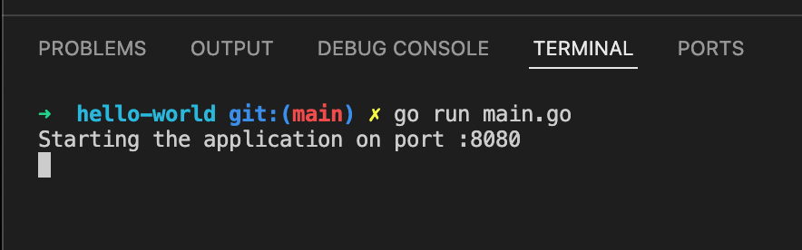
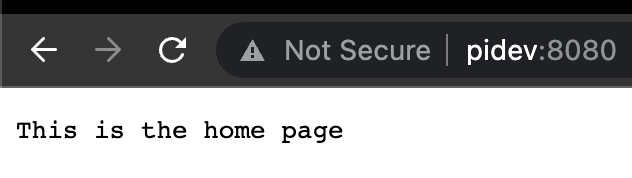

### Hello world is a simple web app that listens for requests on port 8080 for these routes:
- Home
- About
- Divide

### How to start the application
`
go run main.go
`

### What you will see when the app starts

### From the browser

